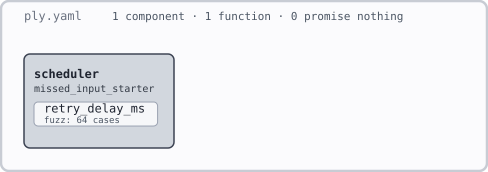
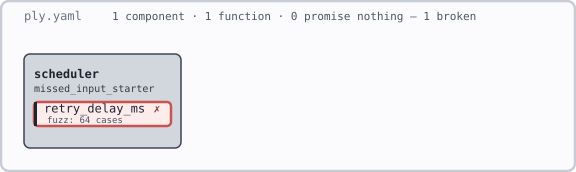
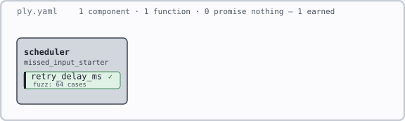

# Read the evidence

A useful visual review ends with a decision: which claim needs attention, what [evidence](glossary.md#earned-evidence) supports it, and where to look next. Practice that review on the retry delay from [lesson 4](05-missed-input.md).

Use the same `exercises/05-missed-input/starter` you are repairing. Capture the failure before changing its body. If you already completed the repair, use the reference drawings below for the before state; you do not need to undo your work.

## Draw the intent first

From the starter directory:

```sh
cargo ply render . -o intent.svg
cargo ply render . --text
```

Open `intent.svg` in a browser. Open the file directly to hover its shapes; a picture embedded in this book may not expose its tooltips.



Read from the outside inward:

1. The frame contains the declared system. Its summary counts [declarations](glossary.md#declaration), not successful checks.
2. The `scheduler` box is a [component](glossary.md#component). It is not a claim that every function in the Rust scheduler has been checked.
3. The `retry_delay_ms` chip names the function listed in this exercise's YAML. Its [check](glossary.md#check) label requests 64 generated cases.

The strip says “0 promise nothing” because the one function listed in this YAML requests a check. It does not count every Rust function in the project. An omitted function is outside this drawing, not implicitly verified.

This command reads `ply.yaml` alone. Our Rust postcondition lives in `src/lib.rs`, so this declaration render cannot show that annotation. Read the source to complete your account of the promise.

Before continuing, predict whether repairing only the Rust body will change this declaration drawing. It should not: the YAML and requested check remain the same.

## Read the visual language

Use the labels and tooltips alongside the shapes. Colour is a cue to investigate, not a sufficient verdict.

| Mark | Meaning and question to ask |
| --- | --- |
| Component box; function chip | Where does this declaration belong? Nested boxes express component nesting. |
| Grey depth in a declaration render | How strong are the requested checks? This is a declared [ceiling](glossary.md#ceiling), not evidence already earned. |
| Hatching; hollow or dashed component border | What has no claims? Absence of a claim is different from a failed claim. |
| Contract mark; check label | What obligation is stated, and which checks were requested? Source annotations may only become available after verification. |
| Green with [earned evidence](glossary.md#earned-evidence) | Which check succeeded, for which claim and inputs? Fuzzing remains finite. |
| Red with a [violation](glossary.md#violation) | Which promise failed? Read the diagnostic before proposing a repair. In a structural drawing, a red barred connection can instead express a [forbidden dependency](glossary.md#deny-rule). |
| Unknown, unsupported, or missing-evidence status | Why could the requested evidence not be earned? This is not a counterexample. |

A component's summary does not replace its children's details. In a declaration drawing, the weakest declared function sets the component's ceiling. Inspect the individual claim before treating a dark or green box as reassuring.

Our lesson has one component and one declared function, so there are no dependency arrows to interpret. In larger specifications, [solid arrows](glossary.md#edge) declare allowed calls, dashed arrows declare data flows, and external boxes mark outside actors. A declared connection is not a runtime trace. Do not infer that a relationship was checked merely because it was drawn.

## Capture the failure

Before repairing the starter, run:

```sh
cargo ply verify . --publish-view --svg failed.svg
```

The nonzero exit is expected here. The completed run should report the arithmetic violation and still write its evidence drawing. `--svg` writes a portable picture; `--publish-view` also publishes a completed snapshot for an interactive client under `target/ply/`.



Find `retry_delay_ms` and its `✗` mark. Hover the function: unlike the declaration-only view, this completed render includes the Rust postcondition and the `P0502` diagnostic. Read the diagnostic in the terminal too. The reference run reports `P0502` with `attempt = 58`: multiplication panicked before the postcondition could be evaluated. Another input may expose the same unsafe calculation.

Explain the chain in your own words: component → function → promised delay → failing input → arithmetic in the body. Open `src/ply_generated_cex.rs` and connect its test to that same input. The drawing locates the problem; the witness makes it reproducible.

## Investigate in Ply Visual

The SVG route above is enough to complete this lesson. For interactive selection and source navigation, use the separate [Ply Visual editor extension](https://github.com/mattyv/ply-vis#install-locally). Follow that repository's installation instructions; its beta interface is versioned separately from this course's pinned CLI.

Open the exercise directory in your editor after installing the extension. Publishing does not upload your source to a public website: the command writes local run artifacts. The extension discovers the spec and its `target/ply/view.json` entry point.

Work through this inspection:

1. Open the completed run for **this starter**. The book repository contains many specs; check the path and run information rather than choosing a similarly named scheduler.
2. Select `retry_delay_ms` to open **Details**. Read **Declaration**, **Verdict**, **Earned evidence**, **Limitations**, and **Diagnostics**. Compare the declaration with the annotation in your source.
3. Use the source button to open the recorded location. Use the terminal diagnostic and generated regression for the full counterexample if the viewer does not display its inputs.
4. Hover the chip for its explanation. Double-click an item to focus it; drag the canvas to pan. Use the **Workspace** breadcrumb to return to the wider view, then **Fit** to fit the canvas. Do this before concluding your review, because focus hides unrelated geometry. The “Fold detail when zoomed out” option also summarises content; a hidden chip has not disappeared from the specification.
5. Keep the earned-evidence, gap, and violation overlays enabled for your final inspection. Hiding an overlay changes visibility, not the underlying evidence.

If the extension says **No Ply specs found**, check which folder you opened. If it says **No completed visual runs**, run verification with `--publish-view` from this starter and inspect any reported error. Opening the viewer alone does not establish evidence.

A completed view is a [snapshot](glossary.md#snapshot). Editing the source does not repair that snapshot or make its old passing evidence apply to your new code. Publish another run after a change and inspect its run information. Use version control to compare code changes; these views show evidence rather than a code diff.

## Compare the repair

Complete lesson 4's repair, retaining the generated regression. Then run:

```sh
cargo test
cargo ply verify . --publish-view --svg repaired.svg
```



Open `failed.svg` and `repaired.svg` side by side. In VS Code, you can also right-click a completed run and choose **Open in New Tab** to keep views alongside each other. Record the run information so you know which source each represents.

Find the `✓` mark and hover to read the `fuzzed(64)` outcome. The function chip changes from red to green, and the strip changes from “1 broken” to “1 earned”; the component box retains its grey declared ceiling. The function and requested check stayed the same. The evidence changed from a violation to a passing generated-input check. The postcondition covers every `u8`; the run earned evidence from 64 accepted cases, not exhaustive proof over that domain.

The green result does not establish persistence, clock accuracy, concurrency safety, or even every behavior of the shared scheduler. The current scheduler never supplies the large failing index. State exactly what was repaired: the public delay function now meets the intended calculation for the checked inputs, and the discovered failure has a passing regression test.

## Check your learning

Answer before opening the explanations:

1. The declaration drawing is unchanged after a repair. Did rendering fail?
2. A grey function requests `fuzz(64)`. Have 64 cases passed?
3. A green function has no diagnostic. Does the whole queue meet its requirements?
4. You hide the violation overlay and the picture looks cleaner. What evidence changed?
5. An old view is green after you edit the function. What must happen before you cite evidence for the edited code?
6. Where do you go from a red chip to a reproducible repair?
7. The strip says “0 promise nothing.” Does that mean every Rust function has a claim?

<details>
<summary>Answers and completion criteria</summary>

1. No. The render reads the declaration, which did not change when you repaired the Rust body.
2. No. The label requests checks; a completed run must supply their outcome.
3. No. Inspect the claim and its finite evidence. Other functions and end-to-end behavior need their own checks.
4. None. You changed which evidence is visible.
5. Run verification again, publish it, and inspect the new result and its run information.
6. Read the function's declaration and diagnostic, inspect the source and counterexample, retain the generated regression, repair the body, then run tests and verification again.
7. No. The strip summarises the declarations in this spec. Functions omitted from it are not counted.

Finish with a short review note naming the claim, its before and after outcomes, the failing input, the evidence earned after repair, and one application property this run did not establish. Keep both evidence drawings with your notes.

</details>
